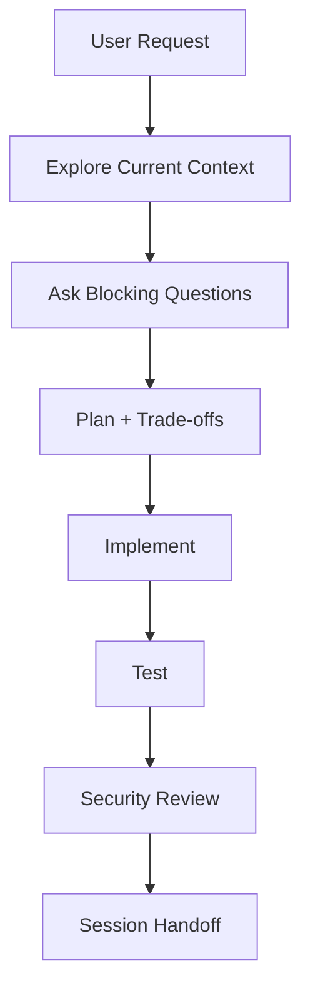
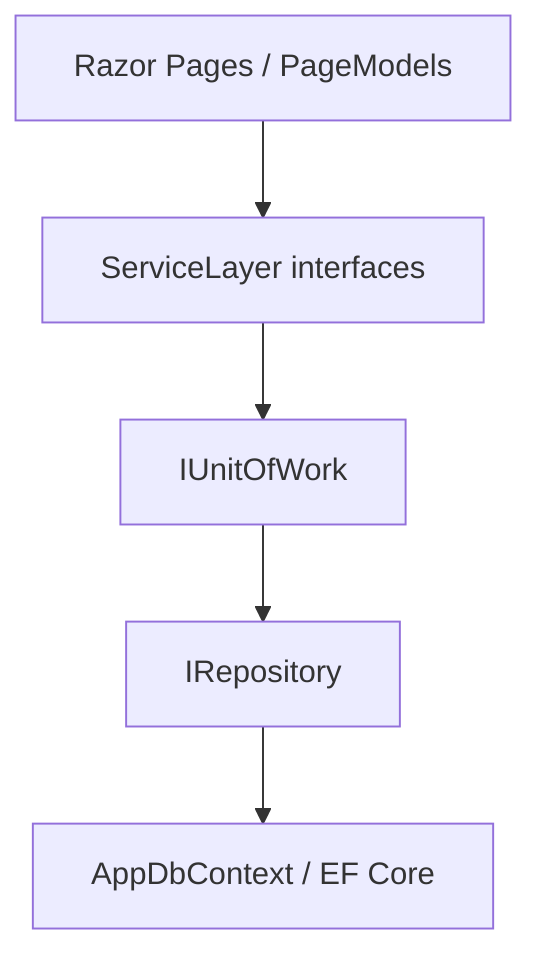

# GROUP1_Ass2 Agent Instructions

This repository contains one ASP.NET Core Razor Pages assignment using a layered architecture:

- `Razor/`: ASP.NET Core Razor Pages presentation layer.
- `ServiceLayer/`: application/business service layer.
- `DataAccessLayer/`: EF Core persistence, entities, repositories, and unit of work.

Treat the project as a production-grade learning project. Preserve this structure unless the user explicitly asks for a different architecture.

## Operating Rules

- Respond at a senior software engineer level. Be direct, precise, and implementation-focused.
- Before coding, inspect the current source, identify affected boundaries, and ask only blocking questions that cannot be answered from the repository.
- When the user proposes an implementation method, explain the implementation flow and provide a trade-off table focused on scalability, maintainability, security, performance, and user experience.
- Use Mermaid for useful architecture, SDLC, or data-flow diagrams.
- Keep changes scoped. Do not add unrelated refactors, dependencies, or generated churn.
- Never initialize Git, add `.gitignore`, or perform destructive source-control actions unless the user explicitly requests it.

## SDLC Workflow

Follow this loop for every meaningful change:

1. Clarify the requirement and acceptance criteria.
2. Inspect the current implementation and dependency graph.
3. Brainstorm the plan, alternatives, trade-offs, and risks.
4. Implement a small vertical change.
5. Add or update unit, integration, and UI tests according to risk.
6. Run build and tests where feasible.
7. Review security, privacy, performance, and maintainability.
8. Update handoff context before push or session end.

## Architecture Rules

- Keep `Razor/` as the presentation layer; do not create a separate MVC app unless explicitly requested.
- Keep Razor PageModels thin. Move reusable, data-access, stateful, security-sensitive, or hard-to-test logic into `ServiceLayer`.
- Keep EF Core usage inside `DataAccessLayer` and service implementations. Razor Pages should depend on service interfaces, not `DbContext`.
- Use `IRepository<T>` for standard entity persistence operations and `IUnitOfWork` to coordinate repository commits.
- Use EF Core async APIs for data access. Avoid blocking on async calls.
- Use view models/input models for UI boundaries. Do not bind EF entities directly to forms that accept user input.
- Prefer simple vertical slices until duplication becomes meaningful enough to justify additional abstractions.

## Dependency Direction

Dependencies must flow downward only:

- `Razor` references `ServiceLayer`.
- `ServiceLayer` references `DataAccessLayer`.
- `DataAccessLayer` does not reference higher layers.

## Code Convention

- Enable and respect nullable reference types.
- Prefer explicit, intention-revealing names over abbreviations.
- Apply SOLID, KISS, and DRY pragmatically.
- Keep methods short enough to review easily. Extract helpers when they reduce cognitive load.
- Use guard clauses for invalid state and validation failures.
- Do not swallow exceptions. Log actionable context without secrets or PII.

## Security Rules

- Never hardcode production secrets, passwords, tokens, API keys, connection strings with credentials, or personal data.
- Development-safe LocalDB connection strings are allowed in `appsettings.Development.json`; production values must come from user secrets, environment variables, or deployment secrets.
- Call `UseAuthentication()` before `UseAuthorization()` if authentication is added.
- Use authorization attributes or policies for protected pages.
- Keep CSRF protection enabled for form posts.
- Rely on Razor HTML encoding. Do not use raw HTML rendering unless the input is trusted and documented.
- Use EF Core parameterized queries or LINQ. Avoid string-concatenated SQL.
- Do not log passwords, tokens, cookies, raw connection strings, reset links, or PII.
- Before handoff, scan changed files for obvious secrets and PII.

## Testing Rules

- Use xUnit for unit and integration tests.
- Use `WebApplicationFactory` for ASP.NET Core integration tests.
- Use Playwright for browser UI tests when UI behavior changes materially.
- Cover home page, CRUD navigation, form validation, protected endpoint/page behavior if auth is added, and global exception behavior.
- Tests must be deterministic and isolated.
- If a verification step cannot run, state the exact command attempted and the blocker.

## CodeGraph

After `.codegraph/` is initialized, prefer CodeGraph for structural questions:

| Question | Tool |
|---|---|
| Where is X defined? | `codegraph_search` |
| What calls Y? | `codegraph_callers` |
| What does Y call? | `codegraph_callees` |
| What would break if Z changes? | `codegraph_impact` |
| Need focused context for an area | `codegraph_context` |

Use native `rg` for literal text searches and file lists.

## Context Handoff

Before push, session handoff, or a new AI session, summarize:

- Goal and status.
- Files and subsystems changed.
- Key decisions and trade-offs.
- Commands run and results.
- Known risks, skipped tests, and next actions.

## Tool-Specific Notes

- Codex should read this `AGENTS.md` as the canonical source.
- Claude Code should use `CLAUDE.md`, which imports this file.
- GitHub Copilot should use `.github/copilot-instructions.md` and path-specific instructions.
- Antigravity should use `.agents/rules` and `.agents/skills`.
