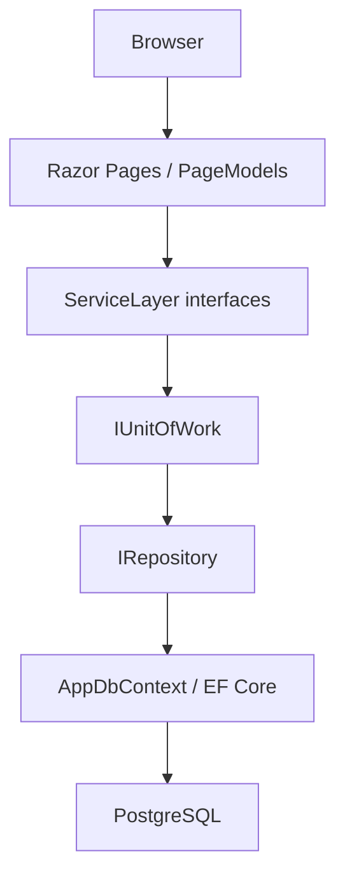
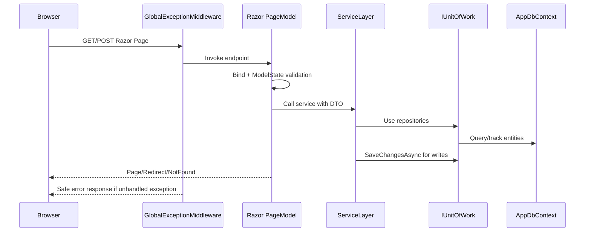

# Architecture Overview - GROUP1_Ass2 Razor Pages

This document describes the layered architecture, request lifecycle, error handling, and extension rules for human and AI reviewers.

## Solution Structure

```text
GROUP1_Ass2.slnx
├── DataAccessLayer/
│   ├── Entities/
│   │   ├── Category.cs
│   │   └── Product.cs
│   ├── Repositories/
│   │   ├── IRepository.cs
│   │   └── Repository.cs
│   ├── UnitOfWork/
│   │   ├── IUnitOfWork.cs
│   │   └── UnitOfWork.cs
│   └── AppDbContext.cs
├── ServiceLayer/
│   ├── DTOs/
│   │   ├── CategoryDto.cs
│   │   └── ProductDto.cs
│   ├── Interfaces/
│   │   ├── ICategoryService.cs
│   │   └── IProductService.cs
│   └── Services/
│       ├── CategoryService.cs
│       └── ProductService.cs
└── Razor/
    ├── Middlewares/
    │   └── GlobalExceptionMiddleware.cs
    ├── Pages/
    │   ├── Categories/
    │   └── Products/
    ├── ViewModels/
    │   ├── CategoryViewModels.cs
    │   └── ProductViewModels.cs
    ├── Program.cs
    └── appsettings.Development.json
```

## Layer Responsibilities

| Layer | Responsibility | Knows About | Must Not Know About |
|---|---|---|---|
| `Razor` | HTTP routing, PageModels, form binding, Razor rendering, DI composition | Service interfaces, DTOs, view models | EF Core `DbContext`, repositories, SQL |
| `ServiceLayer` | Business rules, validation orchestration, entity-to-DTO mapping | `IUnitOfWork`, entities, DTOs | Razor Pages, HTTP, view-specific state |
| `DataAccessLayer` | Entities, EF Core schema, repositories, unit-of-work commit boundary | EF Core, PostgreSQL provider | Services, Razor Pages |

## Dependency Flow



Dependencies flow downward only. `Razor` references `ServiceLayer`; `ServiceLayer` references `DataAccessLayer`; `DataAccessLayer` references no higher layer.

## Request Lifecycle



## Repository and Unit of Work

`IRepository<T>` provides standard CRUD and query composition:

- `GetAllAsync`
- `GetByIdAsync`
- `AddAsync`
- `Update`
- `Delete`
- `FindAsync`
- `Query`

`IUnitOfWork` exposes repositories and centralizes `SaveChangesAsync()`. Repositories do not commit independently.

| Decision | Benefit | Trade-off |
|---|---|---|
| Generic repository | Consistent persistence API | Adds abstraction over EF Core |
| `Query()` escape hatch | Supports `Include`, filtering, ordering, `AsNoTracking` | Leaks query composition into services |
| Unit of Work | Single commit boundary across repositories | Services must remember to call `SaveChangesAsync` |
| DTOs separate from ViewModels | Prevents UI concerns from leaking into services | More classes to maintain |

## Error Handling

`Razor/Middlewares/GlobalExceptionMiddleware.cs` runs early in the pipeline.

| Environment/Caller | Behavior |
|---|---|
| Development | Log then rethrow so developer diagnostics can show details |
| Production browser request | Redirect to `/Error?statusCode=...` |
| Production JSON request | Return `{ statusCode, message, traceId }` |

The middleware logs trace ID, method, and path. It does not log request bodies, cookies, tokens, or PII.

## Dependency Injection

`Razor/Program.cs` registers:

```csharp
var connectionString = builder.Configuration.GetConnectionString("DefaultConnectionString");

builder.Services.AddDbContext<AppDbContext>(options =>
    options.UseNpgsql(connectionString));

builder.Services.AddScoped<IUnitOfWork, UnitOfWork>();
builder.Services.AddScoped<ICategoryService, CategoryService>();
builder.Services.AddScoped<IProductService, ProductService>();
```

`DbContext`, unit of work, and services are scoped per request.

Because this project is configured for an existing PostgreSQL database, startup does not call `EnsureCreatedAsync()` or apply migrations automatically. Database schema changes should be handled explicitly through the database-first workflow or controlled migrations if the team later adopts code-first changes.

## Security Notes

| Area | Rule |
|---|---|
| Over-posting | Bind view models, never EF entities |
| CSRF | Razor Pages form posts use antiforgery by default |
| SQL injection | Use EF Core LINQ and parameterized queries |
| Error leakage | Production responses use generic messages |
| Secrets | Production connection strings must come from environment/user secrets/deployment secrets |
| XSS | Rely on Razor encoding; avoid raw HTML |

## Extension Checklist

To add a new entity:

1. Add an entity class under `DataAccessLayer/Entities`.
2. Add `DbSet` and Fluent API mapping in `AppDbContext`.
3. Add repository property to `IUnitOfWork` and `UnitOfWork`.
4. Add DTOs under `ServiceLayer/DTOs`.
5. Add service interface and implementation.
6. Add view models under `Razor/ViewModels`.
7. Add Razor Pages under `Razor/Pages/<FeatureName>`.
8. Register the service in `Razor/Program.cs`.
9. Add/update tests according to risk.
10. Run `dotnet build GROUP1_Ass2.slnx`.
