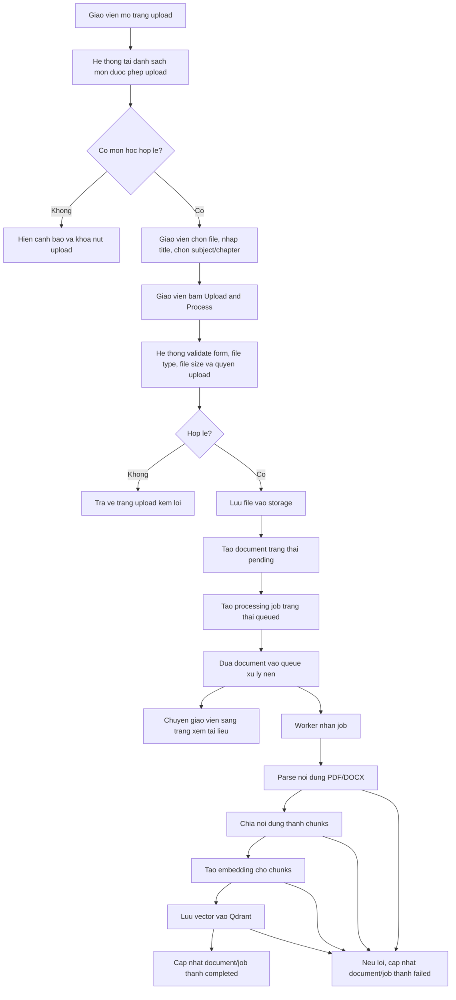

# Flow Upload Tai Lieu Cua Giao Vien

Tai lieu nay mo ta flow giao vien upload tai lieu hoc tap len he thong de xu ly va dua vao kho tri thuc phuc vu viec xem tai lieu, tai xuong va hoi dap bang chat.

## Dieu Kien Bat Dau

- Nguoi dung da dang nhap bang tai khoan giao vien.
- Giao vien co quyen upload cho mon hoc duoc chon.
- File upload co dinh dang `.pdf` hoac `.docx`.
- File khong vuot qua gioi han dung luong cau hinh cua he thong.
- Neu giao vien khong co mon hoc nao duoc phep upload, man hinh upload se hien canh bao va khong cho gui form.

## Cong Nghe Su Dung

| Cong nghe | Vai tro trong flow |
| --- | --- |
| Razor Page | Tao man hinh upload, nhan request upload va dieu huong nguoi dung. |
| Cookie Authentication | Xac dinh giao vien dang dang nhap. |
| Authorization theo role | Gioi han upload cho tai khoan co role `teacher`. |
| Antiforgery Token | Bao ve request upload khoi CSRF. |
| Multipart Form Upload | Gui file `.pdf` hoac `.docx` tu browser len server. |
| DataAnnotations | Validate cac truong bat buoc nhu file, subject va gioi han title. |
| PostgreSQL | Luu document, processing job, subject, teacher va quyen upload. |
| EF Core | Truy van va cap nhat du lieu lien quan den upload. |
| Local File Storage | Luu file goc sau khi upload. |
| BackgroundService | Chay worker xu ly tai lieu trong nen. |
| In-process Queue | Dua document moi upload vao hang doi xu ly. |
| PDF/DOCX Parser | Doc va trich xuat noi dung tu file tai lieu. |
| Tesseract OCR | Trich xuat text tu PDF scan neu OCR duoc bat. |
| Chunking | Chia noi dung tai lieu thanh cac doan nho de embedding. |
| Gemini Embedding | Tao vector embedding cho tung chunk. |
| Qdrant | Luu vector embedding de tim kiem ngu nghia va phuc vu chat. |
| Serilog | Ghi log upload, xu ly thanh cong va loi xu ly. |

## Cau Hinh OCR Cho PDF Scan

- OCR PDF scan duoc bat qua cau hinh `DocumentProcessing:EnablePdfOcr`.
- Mac dinh he thong doc text PDF bang PdfPig truoc; neu so ky tu text qua it, worker moi render tung trang PDF va chay Tesseract OCR.
- Thu muc tessdata mac dinh la `Razor/App_Data/tessdata` va can co hai file `eng.traineddata`, `vie.traineddata`.
- Khong commit file `.traineddata` vao source; moi moi truong local/deployment can tu provision cac file nay.
- Neu OCR can chay nhung thieu tessdata, document/job se chuyen sang `failed` voi loi cau hinh da duoc rut gon.

## Flow Chinh

## Cac Buoc Xu Ly Chi Tiet

1. Giao vien truy cap man hinh upload tai lieu.
2. He thong lay danh sach mon hoc ma giao vien duoc phep upload.
3. Giao vien chon file can upload.
4. Giao vien co the nhap title rieng; neu khong nhap, he thong dung ten file lam title mac dinh.
5. Giao vien chon subject bat buoc.
6. Giao vien co the nhap chapter; neu khong nhap, he thong dung chapter mac dinh cho upload.
7. Khi giao vien gui form, he thong kiem tra:
   - File co ton tai hay khong.
   - Subject co duoc chon hay khong.
   - Title co vuot gioi han ky tu hay khong.
   - Extension co nam trong danh sach cho phep hay khong.
   - Dung luong file co vuot gioi han hay khong.
   - Giao vien co quyen upload subject da chon hay khong.
8. Neu co loi, he thong giu giao vien o trang upload va hien thong bao loi.
9. Neu hop le, he thong luu file vao storage.
10. He thong tao document moi voi trang thai ban dau la `pending`.
11. He thong tao processing job voi trang thai ban dau la `queued`.
12. He thong dua document vao queue de xu ly nen.
13. Giao vien duoc chuyen den trang xem tai lieu vua upload.
14. Worker lay document trong queue va bat dau xu ly.
15. Worker doc file da luu, parse noi dung theo dinh dang PDF hoac DOCX.
16. Noi dung sau khi parse duoc chia thanh cac chunk nho.
17. He thong tao embedding cho tung chunk.
18. He thong luu vector embedding vao Qdrant de phuc vu tim kiem ngu nghia.
19. He thong luu chunk vao database.
20. Neu xu ly thanh cong, document va processing job duoc cap nhat thanh `completed`.
21. Neu co loi trong qua trinh xu ly, document va processing job duoc cap nhat thanh `failed`, dong thoi ghi log loi de dev kiem tra.

## Trang Thai Chinh

| Trang thai | Y nghia |
| --- | --- |
| `pending` | Document da duoc tao va dang cho dua vao xu ly. |
| `queued` | Processing job da duoc tao va dang cho worker nhan. |
| `processing` | Worker dang parse, chunk, embedding va luu vector. |
| `completed` | Xu ly thanh cong, tai lieu san sang de tra cuu/chat. |
| `failed` | Xu ly that bai, can xem log de biet nguyen nhan. |

## Loi Thuong Gap

| Truong hop | Ket qua mong doi |
| --- | --- |
| Chua dang nhap | Khong duoc vao man hinh upload. |
| Khong phai giao vien | Khong co quyen upload tai lieu. |
| Giao vien khong co mon duoc phep upload | Hien canh bao va khoa nut upload. |
| Thieu file | Hien loi yeu cau chon file. |
| Thieu subject | Hien loi yeu cau chon subject. |
| File khong phai `.pdf` hoac `.docx` | Tu choi upload va hien loi dinh dang. |
| File vuot gioi han dung luong | Tu choi upload va hien loi dung luong. |
| Giao vien upload mon khong duoc phan quyen | Tu choi upload va hien loi quyen truy cap. |
| File khong parse duoc | Cap nhat document/job thanh `failed`. |
| Loi embedding hoac Qdrant | Cap nhat document/job thanh `failed`. |

## Ket Qua Thanh Cong

Sau khi flow hoan tat thanh cong:

- File goc da duoc luu trong storage.
- Document co ban ghi trong he thong.
- Processing job ghi nhan qua trinh xu ly.
- Noi dung tai lieu da duoc parse va chia chunk.
- Vector embedding da duoc luu de phuc vu tim kiem va chat.
- Giao vien co the xem, tai xuong va theo doi trang thai tai lieu trong thu vien.
